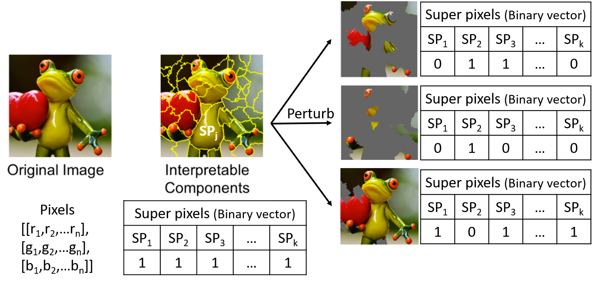
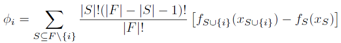
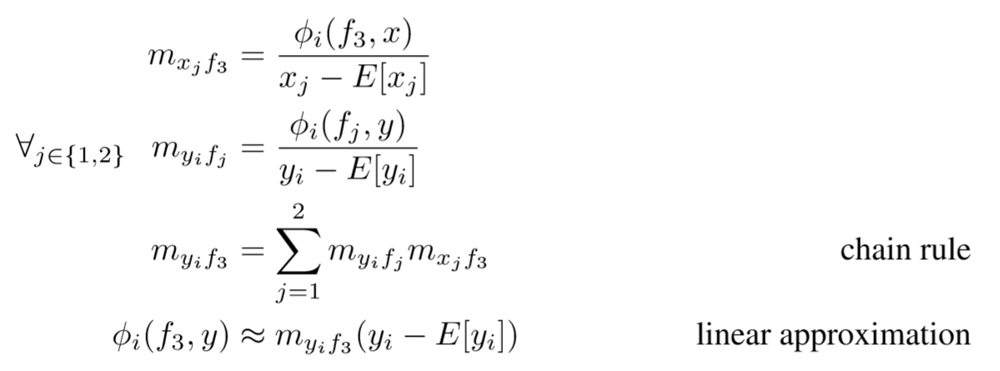

# Introduction to XAI
**Table of Contents**
- [Introduction](#Introduction)
    - [Importance of XAI](#Importance-of-XAI)
    - [Trade off between interpretability and accuracy](#Trade-off-between-interpretability-and-accuracy)
    - [Feature importance](#Feature-importance)

- [XAI Model](#XAI-Model)
    - [Additive Feature Attribution Definition](#Additive-Feature-Attribution-Definition)
    - [Existing Methods](#Existing-Methods)
         1. [LIME](#1-LIME)
         2. [DeepLIFT](#2-DeepLIFT)
         3. [Shapley values](#3-Shapley-values)
         4. [SHAP values](#4-SHAP-values)
- [Citations](#Citations)

## Introduction
### Importance of XAI
Explainable AI, also known as XAI. In contrast to most of advanced AI models which are black boxes, XAI shows the **model interpretability**. In some cases, model interpretability can be quite important. Take health care industry for example, doctors can check out the reasonableness of the diagnosis result from XAI before trusting it. Besides, interpretability also provides insight for users to improve the AI model.

### Trade off between interpretability and accuracy
As mentioned above, interpretability is crutial to a machine learning model. It is easy for simple models (e.g., Linear regression) to globally interpret the relationship between inputs and outputs; however when it comes to complex problems, simple models usually underfit those problems. In contrast, complex models (e.g., Deep neural network) perform better in complex problems but with lower interpretability. Hence, here comes out an issue: the trade off between interpretability and accuracy. To solve this issue, some explanation models (g) are created to do the interpretation from **local level feature importance** for complex models (f). Instead of trying to interpret the whole complex model, the explanation models (g) interpret how the complex model behaved in each single data point.

### Feature importance
Feature importance shows the contribution of each feature and interprets the result of machine learning models. There are two ways to calculate feature importances: 
1. Global level (Overall importance): calculate the influence of X(feature) in a **model**’s prediction (E.g., Gini, GR……)
2. Local level (By-instacne importance): calculate the influence of X(feature) in a **specific sample**’s prediction, which means that different sample may have different feature importance.

## XAI Model
### Additive Feature Attribution Definition
Explanation models use simplified inputs x' that map to the original inputs through a mapping function x = h𝑥(x').

  

Summing all the effects 𝝓 in explanation model(g) approximates the output of the original model(f).

[Notation]                                 
g: Explanation model (e.g., linear regression)   
𝝓i: Contribution of feature i   
x: Sample in original representation  
x': Sample in interpretable representation     
z: Perturbed sample in original representation  
z': Perturbed sample in interpretable representation 

### Existing Methods
#### 1. [LIME](https://www.kdd.org/kdd2016/papers/files/rfp0573-ribeiroA.pdf)
LIME(Local interpretable model-agnostic explanations) is a **Model-Agnostic Approximations** which locally approximate a simple model(explanation model) to a sample by perturbing the input and see how the predictions change. According to the figure showing below, the explanation model which is built for the sample, is not suitable for the whole complex model but can perform well in local level.

**LIME Example: find an explanation model for an image**

Consider a frog image was classified by a complex model, the result shows that "tree frog" is the most likely class, followed by "pool table" and "balloon" with lower probabilities.

In order to interpret the result from the complex model, we use LIME method to build up an explanation model. The first step is to seperate the original image into several interpretable components, which can be viewed as features. Here we use "pixels" for the original image, and "super pixels" for interpretable components. The super pixel is represent in binary, if an interpretabe component exists in the sample, the value would be 1, if it doesn't the value would be 0. The next step is to pertub the super pixels by randomly turn off interpretable components(in this example, make them into gray), then we could get a number of pertubed instances.

In the third step, we use the complex model to classify those pertubed instances and get the prediction result. 

The last step is to build an explanation model through the prediction result of the interpretable components(super pixels) in complex model.

Example & figure reference: [Local Interpretable Model-Agnostic Explanations (LIME): An Introduction](https://www.oreilly.com/learning/introduction-to-local-interpretable-model-agnostic-explanations-lime)

**LIME Objective function**

[Notation]  
f: Complex model (e.g., CNN)                                    
g: Explanation model (e.g., linear regression)  
Ω(g): Complexity of explanation model g  
x: Sample in original representation  
x': Sample in interpretable representation   
z: Perturbed sample in original representation
z': Perturbed sample in interpretable representation 
ùúãùë•(z): Proximity measure between an instance z to x  
D: Distance function (e.g., cosine distance for text, L2 distance for images)

#### 2. [DeepLIFT](https://arxiv.org/abs/1704.02685)
DeepLIFT is a **Model-Specific Approximations** which is used for deep learning model. DeepLIFT can be viewd as an improved version of the gradient method. 

**Gradient Example**  
In the gradient method, the feature contribution is calculated by multiplying the input(x) with the weight: 

In linear regression, it is reasonable to calculate feature contributions from the gradient method; however the method is not suitable for nonlinear models. Below is an example that shows the problem the gradient encounters in a nonlinear model:  

Because there is bias in h2 function, the contribution calculated from the gradient method is unreasonalble to the actual output. DeepLIFT is introduced to solve the problem mentioned above. 

**DeepLIFT Example**  
Instead of considering the gradient, DeepLIFT considers the slope, hence the feature importance becomes:

Below is the same example that calculates feature contributionuses by DeepLIFT:  

[Notation]  
m: Multiplier (slope)  
C: Feature Importance

Deciding the baseline inputs is crutial and might require domain expertise. Take MNIST digits dataset for example, since all the images are white digit with black background, it is reasonable to choose a black image as the baseline.

Reference: [Interpretable Neural Networks](https://towardsdatascience.com/interpretable-neural-networks-45ac8aa91411)  
Example & figure reference: [DeepLIFT Part 3: Nuts & Bolts (1)](https://www.youtube.com/watch?v=f_iAM0NPwnM&list=PLJLjQOkqSRTP3cLB2cOOi_bQFw6KPGKML&index=3)

#### 3. Shapley values
Shapley value is a solution concept in cooperative game theory, which is used to divide the reward for each player according to their contributions. In machine learning model, shapley value can be viewed as average marginal contribution to calculate the importance of a feature by comparing what a model predicts with and without the feature. The order in which a model sees features can affect its predictions, hence every possible order should be considered when calculate shapley values.

[Notation]  
F: the set of all features; S⊆F  
fS∪{i} : model trained with feature i  
fS: model trained without feature i  

**Properties of Shapley value**
1. Local accuracy: the explanation model g(x') should have the same result as the original complex model f(x)

2. Missingness: when a feature is missing, the importance of this feature 𝝓 should be zero (meaning no impact to the model)

3. Consistency: if a feature i has higher impact in model A than model B, then the importance 𝝓i in model A should always be larger than the one in model B

Young (1985) had proved that Shapley values are the only set of values that satisfy three axioms similar to properties mentioned above and a final property that is redundant in this setting.

Reference: [Interpreting complex models with SHAP values](https://medium.com/@gabrieltseng/interpreting-complex-models-with-shap-values-1c187db6ec83)

#### 4. [SHAP values](http://papers.nips.cc/paper/7062-a-unified-approach-to-interpreting-model-predictions)
Since every possible orders should be considered in shapley values, when there is lots of features, it will be computationally unfeasible for calculating shapley values. Hence, SHAP(SHapley Additive exPlanations) values are introduced.

1. Kernel SHAP (Linear LIME + Shapley values): Kernal SHAP is a **Model-Agnostic Approximations** which makes Linear LIME recover Shapley values by adjusting loss function L, weighting kernel πx' and regularization term Ω.

2. Deep SHAP (DeepLIFT + Shapley values): Deep SHAP is a **Model-Specific Approximations** which is adapted from DeepLIFT to approximate Shapley values for deep learning models. Deep SHAP recursively passing multipliers backwards through the network to combine SHAP values of smaller components into SHAP values for the whole network.

[Notation]  
m: Multiplier (slope)  
𝝓i: Contribution of feature i

## Citations
LIME: [“Why Should I Trust You?” Explaining the Predictions of Any Classifier
](https://www.kdd.org/kdd2016/papers/files/rfp0573-ribeiroA.pdf)  
DeepLIFT: [Learning Important Features Through Propagating Activation Differences](https://arxiv.org/abs/1704.02685)  
SHAP Values: [A Unified Approach to Interpreting Model Predictions](http://papers.nips.cc/paper/7062-a-unified-approach-to-interpreting-model-predictions)  
TreeExplainer: [Explainable AI for Trees: From Local Explanations to Global Understanding](https://arxiv.org/abs/1905.04610)

