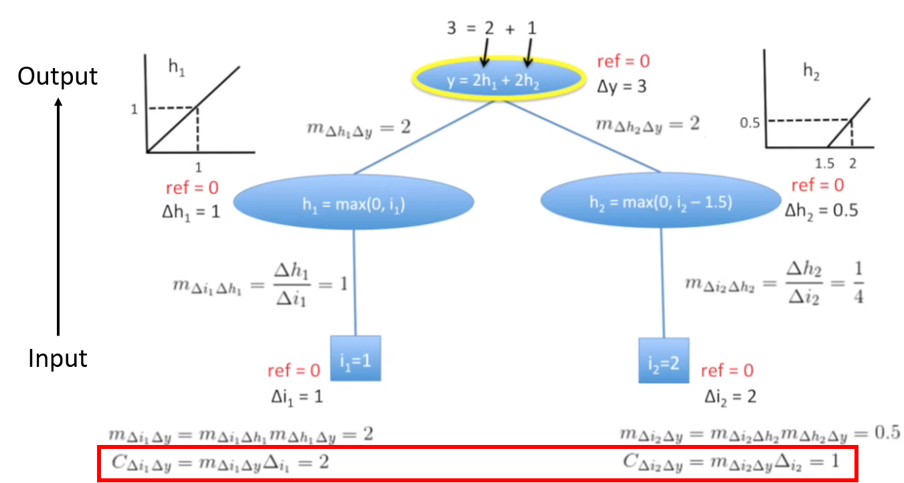

# Interpretable model introduction

## Introduction
**Model interpretability** can be quite important in many applications. Take health care industry for example, if a machine leanring model shows the reason why it classifies a patient to the high risk group of heart disease, then doctors would be able to check out the reasonableness of the result from the model, which increase the user trust. Besides, interpretability also provides the insight for users to improve the model.

### Feature importance
Feature importance shows the contribution of each feature and interprets the result of machine learning models. There are two ways to calculate feature importance: 
1. Global level (Overall importance): calculate the influence of X(feature) in a **model**’s prediction (E.g., Gini, GR……)
2. Local level (By-instacne importance): calculate the influence of X(feature) in a **specific sample**’s prediction, which means that different sample may have different feature importance.

### Trade off between interpretability & accuracy
As mentioned above, interpretability is crutial to a machine learning model. It is always easy for a simple model(e.g., Linear regression) to interpret the relationship between inputs and outputs through global level feature importance; however, for complex models like deep network, they usually have low interpretability even though their accuracy is much better than simple models. Hence, here comes out an issue: trade off between interpretability and accuracy. For the most part, there is non-linear relationship between features, which made complex models more suitable for prediction. Therefore, some explanation models(g) are created to do the interpretation from **local level feature importance** for complex models(f). Instead of trying to interpret the whole complex model, the explanation models(g) interpret how the complex model behaved for one data point.

  

## Interpretable model
### Additive Feature Attribution Definition:

  

𝝓i is the effect which the feature i attributes. Summing all the effects in explanation model(g) approximates the output of the original model(f).

### Existing Methods:
1. [LIME(Local interpretable model-agnostic explanations)](https://www.kdd.org/kdd2016/papers/files/rfp0573-ribeiroA.pdf):
LIME is a **Model-Agnostic Approximations** which locally approximate a simple model(explanation model) to a sample by perturbing the input and see how the predictions change. According to the figure showing below, the explanation model which is built for the sample, is not suitable for the whole complex model but can perform well in local level.

**LIME Example: find an explanation model for an image**

Consider a frog image was classified by a complex model, the result shows that "tree frog" is the most likely class, followed by "pool table" and "balloon" with lower probabilities.

In order to interpret the result from the complex model, we use LIME method to build up an explanation model. The first step is to seperate the original image into several interpretable components, which can be viewed as features. Here we use "pixels" for the original image, and "super pixels" for the interpretable components. The super pixel is represent in binary, if an interpretabe component exists in the sample, the value would be 1, if it doesn't the value would be 0. The next step is to randomly pertub the super pixels by turning them off(make the component into gray), then we could get a number of pertubed instances.

In the third step, we use the complex model to classify those pertubed instances and get the prediction result. 

The last step is to build an explanation model through the interpretable components(super pixels) while consider the prediction result from the complex model as the ture target.

Example reference: [Local Interpretable Model-Agnostic Explanations (LIME): An Introduction](https://www.oreilly.com/learning/introduction-to-local-interpretable-model-agnostic-explanations-lime)

**LIME Objective function**

[Notation]  
f: Complex model (e.g., CNN)                                    
g: Explanation model (e.g., linear regression)  
Ω(g): Complexity of explanation model g  
x: Original representation  
x': Interpretable representation  
z': Perturbed sample in interpretable representation  
z: Perturbed sample in Original representation  
ùúãùë•(z): Proximity measure between an instance z to x  
D: Distance function (e.g., cosine distance for text, L2 distance for images)

2. [DeepLIFT](https://arxiv.org/abs/1704.02685): DeepLIFT is a **Model-Specific Approximations** which is used for deep learning model. DeepLIFT can be viewd as an improved version of the gradient. 

**Gradient Example**  
The feature importance calculate from the gradient is by multiplying the input(x) with the weight: 

In linear regression, it is reasonable to calculate feature contributions from the gradient; however it is not suitable for nonlinear models. Below is an example that shows the problem the gradient encounters in a nonlinear model:  

Because there is bias in h2 function, the contribution calculate from the gradient method is unreasonalble to the actual output.

**DeepLIFT Example**  
DeepLIFT consider the slope instead of the gradient, hence the feature importance become:

Deciding the baseline inputs is crutial and might require domain expertise.

[Notation]  
m: Multiplier(slope)  
C: Feature Importance

Example reference: [DeepLIFT Part 3: Nuts & Bolts (1)](https://www.youtube.com/watch?v=f_iAM0NPwnM&list=PLJLjQOkqSRTP3cLB2cOOi_bQFw6KPGKML&index=3) 

Reference: [Interpretable Neural Networks](https://towardsdatascience.com/interpretable-neural-networks-45ac8aa91411)

3. Shapley value: Shapley value is a solution concept in cooperative game theory used to divide the reward for each player according to their contributions. In machine learning model, shapley value can be viewed as average marginal contribution to calculate the importance of a feature by comparing what a model predicts with and without the feature. The order in which a model sees features can affect its predictions, hence every possible order should be considered.

[Notation]  
F: the set of all features; S⊆F  
fS∪{i} : model trained with feature i  
fS: model trained without feature i  

Reference: [Interpreting complex models with SHAP values](https://medium.com/@gabrieltseng/interpreting-complex-models-with-shap-values-1c187db6ec83)

4. [SHAP(SHapley Additive exPlanations)](http://papers.nips.cc/paper/7062-a-unified-approach-to-interpreting-model-predictions)
